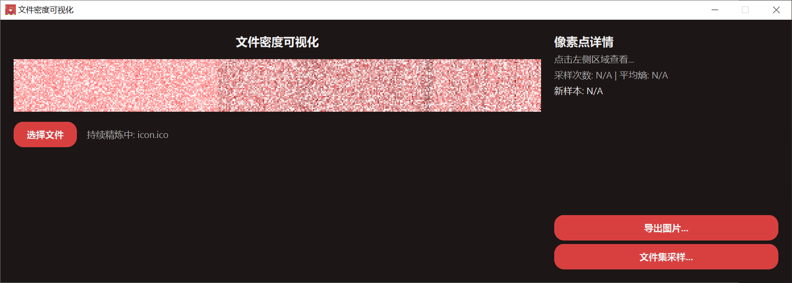
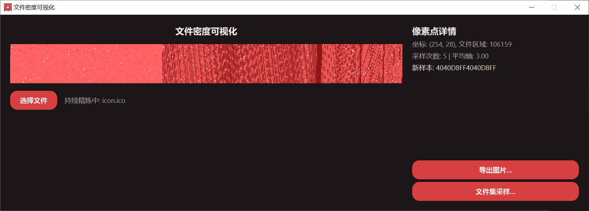
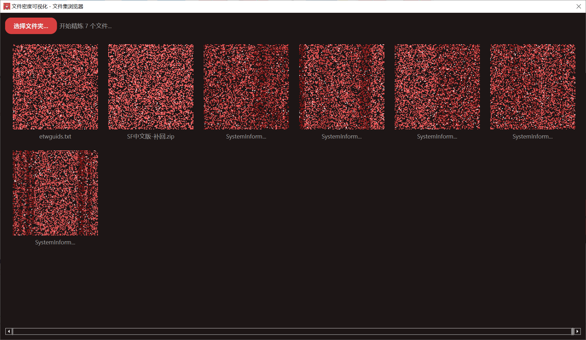
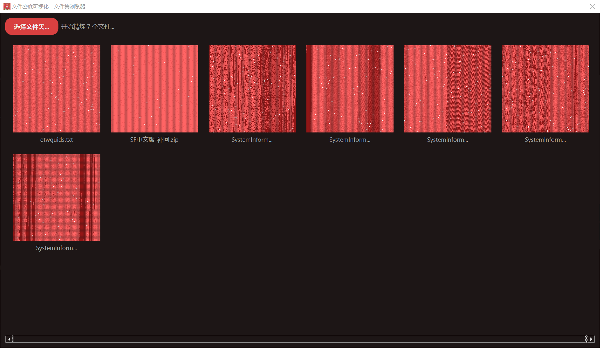

# 文件密度可视化工具 (File Density Visualizer)

这是一个使用 Python 和 PyQt6 开发的桌面应用程序，它可以将任意文件的二进制数据渲染成一张“密度图”。通过对文件进行字节采样，并根据采样数据的“熵”（即数据种类的多样性）来着色，帮助用户直观地分析文件的内部结构、数据分布和复杂度。

文件的不同区域（例如，高熵的压缩数据、低熵的填充数据、重复的文本或代码段等）在可视化结果中会呈现出不同的纹理和颜色。

##  功能特性

- **单文件实时可视化**: 选择任意文件，实时查看其数据密度图。
- **持续精炼**: 初次渲染后，程序会持续在后台采样，不断优化图像细节。
- **像素点详情**: 点击图像任意位置，可查看该区域对应的文件坐标、采样次数和平均熵。
- **文件集浏览器**: 可同时渲染一个文件夹下的所有文件，便于进行横向对比分析。
- **高质量图片导出**: 支持将可视化结果导出为高分辨率的 PNG 图片。
- **多线程处理**: 充分利用多核心 CPU 进行并行采样，提升渲染速度和UI响应能力。
- **现代感UI**: 界面采用深色主题，关键操作带有平滑的色彩渐变动画。

##  运行效果

#### 1. 主界面 - 单文件可视化

程序启动后，可以选择一个文件进行分析。下图展示了对一个 `.ico` 图标文件的可视化过程，右侧可以实时查看像素点的详细信息。


*<p align="center">初始渲染效果</p>*


*<p align="center">点击像素点查看详细数据</p>*


#### 2. 文件集浏览器

该功能可以一次性可视化一个文件夹下的多个文件，非常适合用于比较不同文件之间的数据结构差异。


*<p align="center">文件集初始扫描效果</p>*


*<p align="center">经过持续精炼后的效果，文件结构特征更加明显</p>*


## 🛠️ 如何使用

### 环境要求

- Python 3.x
- PyQt6
- pywin32 (仅在 Windows 平台上需要)

### 安装依赖

```bash
pip install PyQt6 pywin32
```

### 运行程序

1.  将项目代码保存到本地。
2.  在项目根目录下打开终端，运行以下命令：

```bash
python main.py
```
