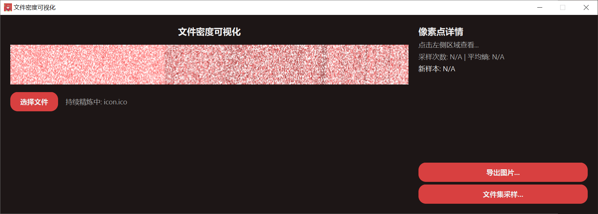
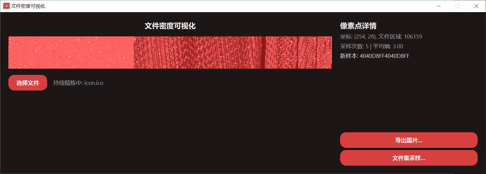
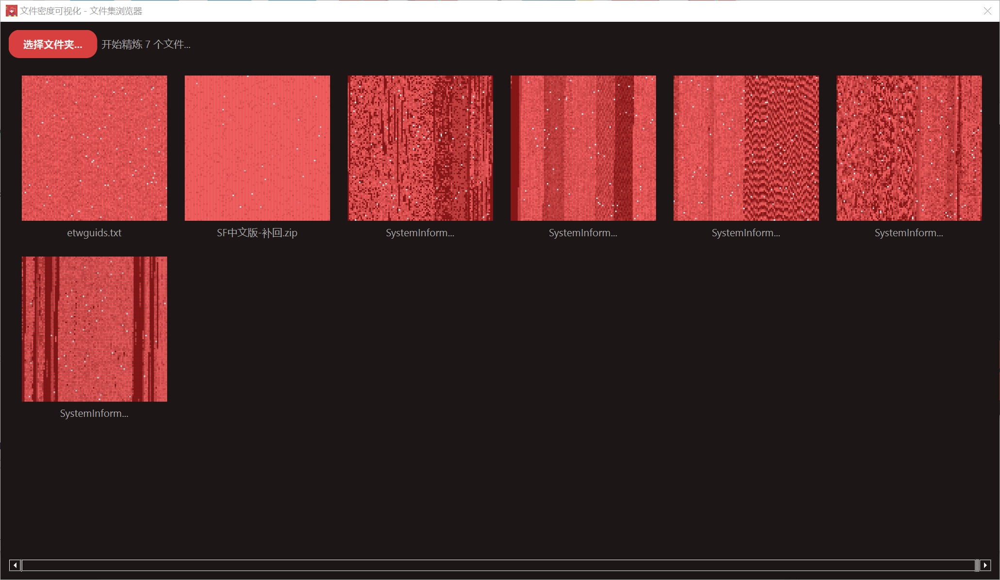

# 文件密度可视化工具 (File Density Visualizer)

这是一个使用 Python 和 PyQt6 开发的桌面应用程序，它可以将任意文件的二进制数据渲染成一张“密度图”。通过对文件进行字节采样，并根据采样数据的“熵”（即数据种类的多样性）来着色，帮助用户直观地分析文件的内部结构、数据分布和复杂度。

文件的不同区域（例如，高熵的压缩数据、低熵的填充数据、重复的文本或代码段等）在可视化结果中会呈现出不同的纹理和颜色。

## ✨ 功能特性

- **单文件实时可视化**: 选择任意文件，实时查看其数据密度图。
- **持续精炼**: 初次渲染后，程序会持续在后台采样，不断优化图像细节。
- **像素点详情**: 点击图像任意位置，可查看该区域对应的文件坐标、采样次数和平均熵。
- **文件集浏览器**: 可同时渲染一个文件夹下的所有文件，便于进行横向对比分析。
- **高质量图片导出**: 支持将可视化结果导出为高分辨率的 PNG 图片。
- **多线程处理**: 充分利用多核心 CPU 进行并行采样，提升渲染速度和UI响应能力。
- **现代感UI**: 界面采用深色主题，关键操作带有平滑的色彩渐变动画。

## 📸 运行截图

#### 1. 主界面 - 单文件可视化

程序启动后，可以选择一个文件进行分析。下图展示了对一个 `.ico` 图标文件的可视化过程，右侧可以实时查看像素点的详细信息。


*<p align="center">初始渲染效果</p>*


*<p align="center">点击像素点查看详细数据</p>*


#### 2. 文件集浏览器

该功能可以一次性可视化一个文件夹下的多个文件，非常适合用于比较不同文件之间的数据结构差异。


*<p align="center">文件集初始扫描效果</p>*


*<p align="center">经过持续精炼后的效果，文件结构特征更加明显</p>*


## 🛠️ 如何使用

### 环境要求

- Python 3.x
- PyQt6
- pywin32 (仅在 Windows 平台上需要)

### 安装依赖

```bash
pip install PyQt6 pywin32
```

### 运行程序

1.  将项目代码保存到本地。
2.  在项目根目录下打开终端，运行以下命令：

```bash
python main.py
```
*(假设主文件名为 `main.py`)*

## 💡 技术实现亮点

该项目采用了一些有趣的技术来实现其核心功能，以下是一些关键代码片段的展示：

### 1. 跨平台文件共享读取

为了确保在文件被其他程序占用时（尤其是在Windows上）也能顺利读取，程序实现了一个跨平台的安全文件打开函数。这可以有效避免因文件锁定而导致的读取失败。

```python
# --- Windows-specific shared open function ---
def open_file_for_shared_read(filepath):
    if sys.platform == "win32":
        try:
            handle = win32file.CreateFile(
                filepath, win32con.GENERIC_READ,
                win32con.FILE_SHARE_READ | win32con.FILE_SHARE_WRITE | win32con.FILE_SHARE_DELETE,
                None, win32con.OPEN_EXISTING, win32con.FILE_ATTRIBUTE_NORMAL, None
            )
            fd = msvcrt.open_osfhandle(handle.Detach(), os.O_RDONLY)
            return os.fdopen(fd, 'rb')
        except Exception: return None
    else:
        return open(filepath, 'rb')
```

### 2. 基于数据熵的动态着色

程序的核心是将一小块二进制数据（样本）中不同字节的数量（即“熵”）映射到一个颜色梯度上。高熵（数据复杂，重复度低）的区域颜色更亮，反之则更暗。平滑的颜色过渡是通过线性插值实现的。

```python
class VisualizationWidget(QWidget):
    # ...

    def _interpolate_color(self, start_color, end_color, t):
        r = int(start_color.red() * (1 - t) + end_color.red() * t)
        g = int(start_color.green() * (1 - t) + end_color.green() * t)
        b = int(start_color.blue() * (1 - t) + end_color.blue() * t)
        return QColor(r, g, b)

    def get_color_for_score(self, score):
        # 将分数 (1-8) 映射到 0.0-1.0 的范围
        t = (score - 1.0) / 7.0
        return self._interpolate_color(AppConfig.GRADIENT_START, AppConfig.GRADIENT_END, t)
```

### 3. 多线程并行采样

为了在处理大文件时不阻塞UI并加快渲染速度，程序将文件渲染任务分配给多个工作线程 (`RenderWorker`)。主处理线程 (`FileProcessorThread`) 负责将文件的所有采样点随机打乱，然后平均分配给与CPU核心数相同的工人线程，实现并行处理。

```python
class FileProcessorThread(QThread):
    # ...
    def run(self):
        # ...
        # 将所有坐标点随机打乱
        all_coordinates = [(x, y) for y in range(AppConfig.LOGICAL_HEIGHT) for x in range(AppConfig.LOGICAL_WIDTH)]
        random.shuffle(all_coordinates)
        
        # 计算每个工人的任务量并切分
        coords_per_worker = (AppConfig.TOTAL_POINTS + AppConfig.NUM_WORKERS - 1) // AppConfig.NUM_WORKERS
        coord_chunks = [all_coordinates[i:i + coords_per_worker] for i in range(0, AppConfig.TOTAL_POINTS, coords_per_worker)]

        # 创建并启动工人线程
        for chunk in coord_chunks:
            worker = RenderWorker(self.file_path, chunk, chunk_size, AppConfig.LOGICAL_HEIGHT, self.is_persistent)
            # ... connect signals ...
            self.workers.append(worker)
            worker.start()
```